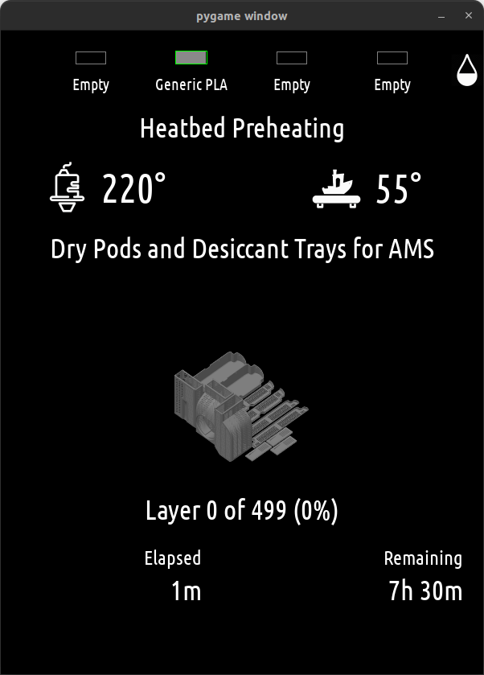
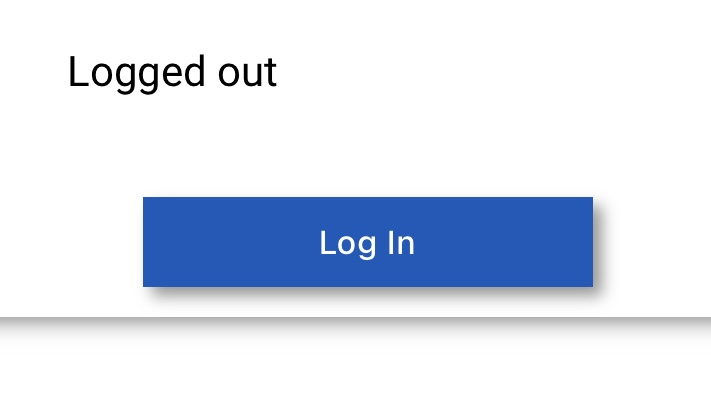

============================
Bambulab module for PyMirror
============================

This is a module for `PyMirror <https://github.com/kanflo/pymirror/>`_ displaying information about you Bambulab 3D printer using eg. a Raspberry Pi and any display you have lying around:

The module will access your printer (assuming it is connected to the same LAN, cloud connection has not been tried) and will download the cover image for the current print job from Bambulab's cloud.

To install this module, you first need to install `PyMirror <https://github.com/kanflo/pymirror/>`_ on a Raspberry Pi or any other computer running Linux. Windows should work, but is untested. Familiarize yourself with the PyMirror `example "mirror" <https://github.com/kanflo/pymirror/tree/main/example>`_ and its `configuration <https://github.com/kanflo/pymirror/tree/main/example/conf.yml>`_.

This module requires the following configuration section in your PyMirror configuration file:

.. code-block::

   [bambulab]
   source = bambulab
   top = 50
   left = 0
   width = -1
   height = 1350

   device_type = P1S
   serial = <your printer serial>
   host = <your printer local IP address>
   access_code = <your printer access code>
   auth_token_file = /tmp/.authtoken
   region = <your region, eg EU>
   email = <your email used to log in to Bambulab>
   password = <password>
   username = <Bambulab user name>

When you start the PyMirror instance, a QR code will be displayed which leads to a local web server used for logging in to Bambulab's cloud. The reason for this is that you probably do not want keyboard and mouse connected.

Scanning this QR code opens the following page:

Pressing the "Log in" button send a code to your email address, just like when logging in to BambuStudio. Enter the code on the next screen and you should be logged in.

=========
Security?
=========

This project uses the same code as the Home Assistant Bambulab integration (`HA-Bambulab <https://github.com/greghesp/ha-bambulab>`_). Your credentials are only used to logon to the Bambulab cloud and are never used in any other form. While the local webb server does not use HTTPS, the only "senstive" thing sent is the verification code which expires as soon as it is used.

==========
Installing
==========

See the the `example <https://github.com/kanflo/pymirror-bambulab/tree/main/docs/example/>`_

Let's start with a demo. You need Python 3.10 and git installed. Make sure to follow the step creating a copy of the configuration file before entering your credentials. The ha-bambulab component is a submodule that needs symlinking as it is not (yet) available via pip.

.. code-block::

   git submodule add https://github.com/kanflo/pymirror-bambulab.git
   cd pymirror-bambulab
   git submodule init && git submodule update
   ln -s ha-bambulab/custom_components/bambu_lab/pybambu pybambu
   cp conf-template.yml conf.yml

   cd docs/example
   ln -s ../.. bambulab

   python -m venv venv && source venv/bin/activate
   pip install -r ../../requirements.txt --upgrade
   pip install git+https://github.com/kanflo/pymirror.git@618f657caf3ff3b108735e379742315b9ddd5094#egg=PyMirror

   python -m pymirror -c conf.yml -s 0.5

